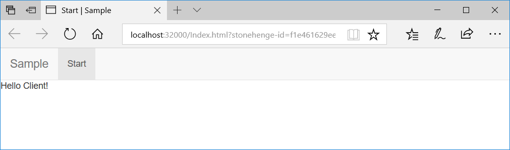
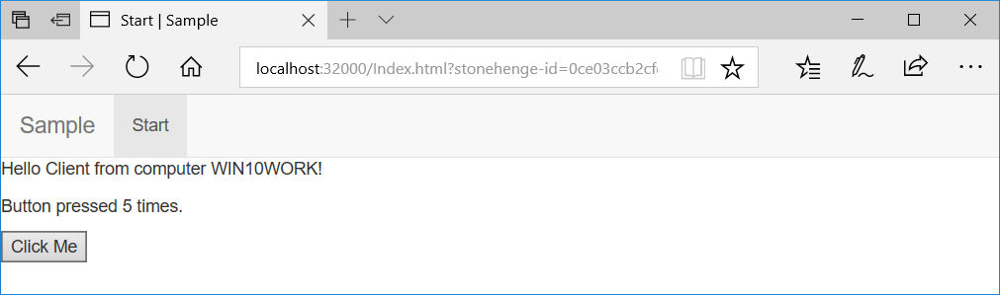

# Getting Started with stonehenge

## Create new Console Project
Choose .NET Framework 4.6 or above

## Add stonehenge2 Nuget package

## Add code to Main()

The server deploys resources to the client. So we first need a resource loader.
``` csharp
    var loader = StonehengeResourceLoader.CreateDefaultLoader();
```
Next we have to decide what client (JavaScript) framework to use.    
This description uses [aurelia](http://aurelia.io/).    
It takes the loader, an application title and a start page name as initialization parameters.
``` csharp
    var aurelia = new AureliaResourceProvider();
    aurelia.InitProvider(loader, "Sample", "start");
```
Next we have to decide what hosting environment to use.    
This description uses [Katana](https://docs.microsoft.com/en-us/aspnet/aspnet/overview/owin-and-katana/an-overview-of-project-katana) - the Microsoft [Owin](http://owin.org/) stack.    
``` csharp
    var server = new KatanaHost(loader);
```
Finally we have to start the server giving a listening address and a TCP port.
``` csharp
    //           Title     NoSSL  ListenOn     Port
    server.Start("Sample", false, "localhost", 32000);
```

Adding some console logging, error handling and termination code we should end up like this.
``` csharp
    static void Main(string[] args)
    {
        Console.WriteLine(@"Sample starting");

        // resource loader
        var loader = StonehengeResourceLoader.CreateDefaultLoader();

        // client framework
        var aurelia = new AureliaResourceProvider();
        aurelia.InitProvider(loader, "Sample", "start");

        // hosting
        var server = new KatanaHost(loader);
        if (!server.Start("Sample", false, "localhost", 32000))
        {
            Console.WriteLine(@"Failed to start server on: " + server.BaseUrl);
            Environment.Exit(1);
        }

        // wait for user pressing Ctrl+C to terminate
        var terminate = new AutoResetEvent(false);
        Console.CancelKeyPress += (sender, eventArgs) => { terminate.Set(); };
        Console.WriteLine(@"Started server on: " + server.BaseUrl);
        terminate.WaitOne();
        Console.WriteLine(@"Server terminated.");
        server.Terminate();
    }
```

## Adding the initial content
By convention stonehenge looks for all content pages in a folder named "app". This is true for file and resource based content. This sample uses embedded resources to store all content.

Create a solution folder named "app".

Given "start" as the entry point in then InitProvider method create a html file named "start.html" within the "app" solution folder. Mark the file as "Embedded Resource" in the file's properties pane.

Enter file content. As we use Aurelia the page has to be a template.
```html
<template>
    <p>Hello Client!</p>
</template>
```

## Adding the corresponding server side ViewModel
Every client side page or component needs to have a corresponding server side ViewModel.

Create a solution folder named "ViewModels".

Create a class named "StartVm" in folder "ViewModels".    
By convention stonehenge looks for a class named as the html resource followed by "Vm". This can be overwritten if desired.

The class must derive from the stonehenge class ActiveViewModel.
``` csharp
    public class StartVm : ActiveViewModel
    {
    }
```

## First run
This is it. We are ready for the first run!

Start the application. The output should be as follows:

        Sample starting
        Started server on: http://localhost:32000

Now start your browser and navigate to http://localhost:32000

After a short splash screen "Sample loading..." you shold see the following SPA application:



## Add server side content
To add some server side content, let's add the computer's name.

Add the following property to StartVm:
``` csharp
    public string ComputerName => Environment.MachineName;
```

To display this in the view (start.html) add a binding in the page like this:
```html
<template>
    <p>Hello Client from computer ${ComputerName}!</p>
</template>
```

Starting the application now will result in displaying

        Hello Client from computer WIN10WORK! 

where WIN10WORK will be replaced with your computer's name.

## Add client side actions
To do some interaction from the client side, let's add a button and count how often it is pressed.

Add the following property to StartVm:
``` csharp
    public int CountPressed { get; private set; }
```

And the following method marked as ActionMethod by using stonehenge's attribute:
``` csharp
    [ActionMethod]
    public void ButtonPressed()
    {
        CountPressed++;
    }
```

In start.html add the following two lines within the template.
```html
    <p>Button pressed ${CountPressed} times.</p>
    <p><button click.delegate="ButtonPressed()">Click Me</button></p>
```

Start the application to see it work.

(after clicked the button five times)

